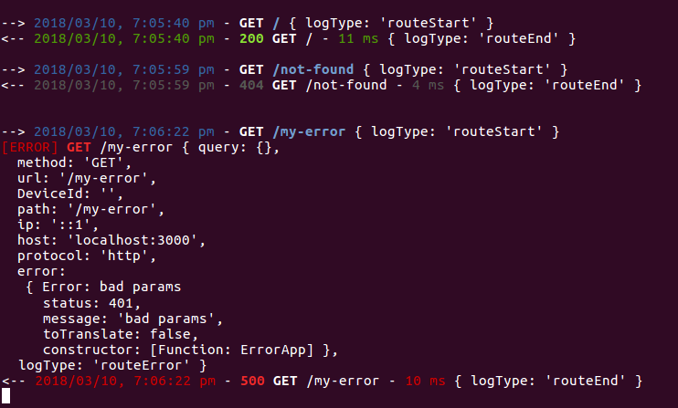

# @ailo/koa-logger-middleware

A logger middleware for koa2 with **color** and customizable logger as **winstonjs**.



## Usage example

```sh
yarn add koa-logger-middleware
```

```ts
import { koaLoggerMiddleware } from "koa-logger-middleware";

app.use(
  koaLoggerMiddleware({
    // your options
  })
);
```

### Options

To see all option refer to `src/index.ts` file.

- **logger**: [Object] - eg: winstonjs, by default is console with coloration.

  ```js
  const winstonLogger = winston.createLogger({
    level: "info",
    format: winston.format.json(),
    transports: [
      new winston.transports.Console({
        format: winston.format.simple(),
        colorize: true,
      }),
    ],
  });

  koaLoggerMiddleware({ logger: winstonLogger });
  ```

- **onStartFormat**: [Function] - format the string to log on request start:
  ```js
  koaLoggerMiddleware({
    onStartFormat(ctx) {
      const { start } = ctx.__logger;
      return `START: ${this.dateFormat(start)} - ${ctx.method} ${ctx.url}`;
    },
  });
  ```
- **onErrorFormat**: [Function] - same as onStartFormat but when error occurred
- **onEndFormat**: [Function] - same as onStartFormat but on response end

## Development

```sh
yarn
yarn start
```

## Testing

```sh
yarn lint # prettier and eslint
yarn test # unit tests
yarn test:watch # unit tests in watch mode
```

## Releasing

**Note: Releasing is done manually (CI isn't configured yet).** Linters, tests, build and so on are run during each `git push` / `yarn release`.

```sh
yarn release # will automatically ask you about version bump, run tests and build, and push new version to git & npm
```
